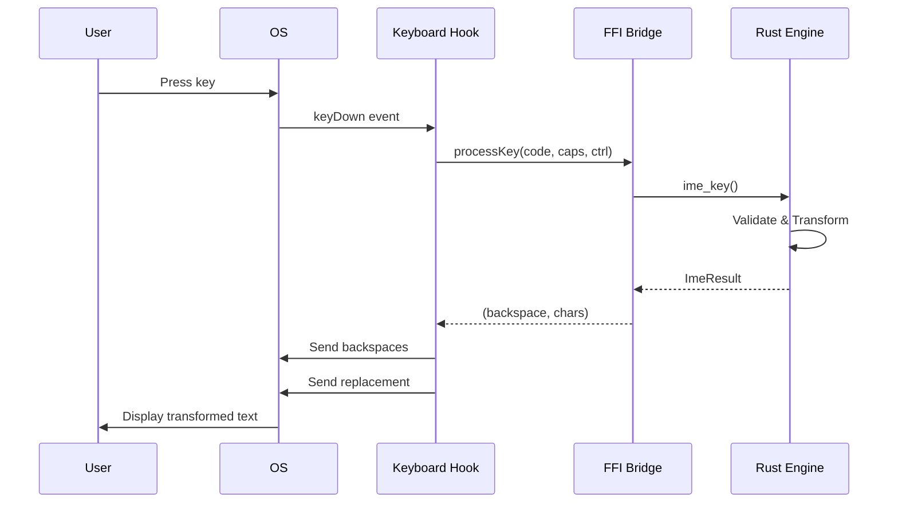

## Overview

Gõ Nhanh is a cross-platform Vietnamese input method application with a validation-first, pattern-based architecture. The system consists of platform-specific UI layers (macOS, Windows) communicating with a shared Rust core engine via FFI.

## High-Level Architecture

```
┌──────────────────────────────────────────┐   ┌──────────────────────────────────────────┐
│         macOS Application                │   │      Windows Application                 │
│                                          │   │                                          │
│  ┌────────────────────────────────┐     │   │  ┌────────────────────────────────┐     │
│  │     SwiftUI Menu Bar           │     │   │  │   WPF System Tray UI           │     │
│  │  • Input method selector       │     │   │  │  • Input method selector       │     │
│  │  • Enable/disable toggle       │     │   │  │  • Enable/disable toggle       │     │
│  │  • Settings, About, Update     │     │   │  │  • Settings, About, Update     │     │
│  └────────────┬────────────────────┘     │   │  └────────────┬────────────────────┘     │
│               │                          │   │               │                          │
│  ┌────────────▼────────────────────┐     │   │  ┌────────────▼────────────────────┐     │
│  │ CGEventTap Keyboard Hook        │     │   │  │ SetWindowsHookEx Keyboard Hook  │     │
│  │ • Intercepts keyDown events     │     │   │  │ • Intercepts WH_KEYBOARD_LL     │     │
│  │ • Smart text replacement        │     │   │  │ • SendInput for text            │     │
│  └────────────┬────────────────────┘     │   │  └────────────┬────────────────────┘     │
│               │                          │   │               │                          │
│  ┌────────────▼────────────────────┐     │   │  ┌────────────▼────────────────────┐     │
│  │    RustBridge (FFI Layer)       │     │   │  │   RustBridge.cs (P/Invoke)     │     │
│  │  • C ABI function calls         │     │   │  │  • P/Invoke DLL function calls  │     │
│  │  • Pointer safety handling      │     │   │  │  • UTF-32 interop               │     │
│  └────────────┬────────────────────┘     │   │  └────────────┬────────────────────┘     │
└───────────────┼──────────────────────────┘   └───────────────┼──────────────────────────┘
                │                                               │
                └───────────────────┬──────────────────────────┘
                                    │
                         extern "C" / P/Invoke
                                    ↓
         ┌─────────────────────────────────────────────┐
         │     Rust Core Engine (Platform-Agnostic)   │
         │     7-Stage Validation-First Pipeline       │
         └─────────────────────────────────────────────┘
```

## Core Components

### Platform Layer

<Tabs>
  <Tab title="macOS">
    <CodeGroup>
      ```swift SwiftUI Menu Bar
      // Menu bar interface for input method control
      MenuBarController.init()
        ├─ Create status bar icon
        ├─ Load settings from UserDefaults
        ├─ If accessibility trusted: startEngine()
        └─ Otherwise: show permission prompt
      ```

      ```swift CGEventTap Hook
      // System-wide keyboard event interception
      let eventMask: CGEventMask = (1 << CGEventType.keyDown.rawValue)
      
      let tap = CGEvent.tapCreate(
          tap: .cghidEventTap,
          place: .headInsertEventTap,
          options: .defaultTap,
          eventsOfInterest: eventMask,
          callback: keyboardCallback,
          userInfo: nil
      )
      ```
    </CodeGroup>

    **Accessibility Permission Required:**
    - API: `AXIsProcessTrusted()` checks permission
    - User must add app to: System Settings → Privacy & Security → Accessibility
    - App restart required after granting permission
  </Tab>

  <Tab title="Windows">
    <CodeGroup>
      ```csharp WPF System Tray
      // System tray interface for input method control
      // • Input method selector
      // • Enable/disable toggle
      // • Settings, About, Update
      ```

      ```csharp Keyboard Hook
      // Low-level keyboard hook
      SetWindowsHookEx(
          WH_KEYBOARD_LL,
          hookCallback,
          hInstance,
          0
      )
      
      // Text replacement via SendInput
      ```
    </CodeGroup>
  </Tab>
</Tabs>

### FFI Interface

The Rust core engine exposes a C-compatible ABI for cross-platform integration:

```rust core/src/lib.rs
/// Initialize engine (call once)
#[no_mangle]
pub extern "C" fn ime_init()

/// Process keystroke
#[no_mangle]
pub extern "C" fn ime_key(key: u16, caps: bool, ctrl: bool) -> *mut Result

/// Process keystroke with extended parameters
#[no_mangle]
pub extern "C" fn ime_key_ext(key: u16, caps: bool, ctrl: bool, shift: bool) -> *mut Result

/// Set input method (0=Telex, 1=VNI)
#[no_mangle]
pub extern "C" fn ime_method(method: u8)

/// Enable/disable engine
#[no_mangle]
pub extern "C" fn ime_enabled(enabled: bool)

/// Clear buffer
#[no_mangle]
pub extern "C" fn ime_clear()

/// Free result
#[no_mangle]
pub unsafe extern "C" fn ime_free(result: *mut Result)
```

**Result Structure:**

```c
typedef struct {
    uint32_t chars[32];      // UTF-32 output characters
    uint8_t action;          // 0=None, 1=Send, 2=Restore
    uint8_t backspace;       // Number of chars to delete
    uint8_t count;           // Number of valid chars
    uint8_t _pad;            // Padding for alignment
} ImeResult;
```

### Rust Core Engine

Platform-agnostic Vietnamese input processing:

```rust
pub struct Engine {
    buf: Buffer,              // Circular buffer (256 chars max)
    method: u8,               // 0=Telex, 1=VNI
    enabled: bool,
    last_transform: Option<Transform>,
    shortcuts: ShortcutTable,
    raw_input: Vec<(u16, bool, bool)>,
    // ... configuration flags
}
```

**Key Features:**
- Thread-safe via `Mutex<Option<Engine>>`
- 7-stage processing pipeline
- Validation-first approach
- Pattern-based transformation
- User-defined shortcuts

## Data Flow

### Keystroke Processing Flow

```
User types key
   ↓
CGEventTap/SetWindowsHookEx callback fires
   ↓
Extract keycode + modifier flags
   ↓
Check global hotkey (Ctrl+Space) → Toggle Vietnamese
   ↓
Call RustBridge.processKey()
   ├─ Call ime_key(keycode, caps, ctrl)
   ├─ Receive ImeResult
   ├─ Extract UTF-32 chars → Character array
   └─ Return (backspaceCount, chars) tuple
   ↓
If transformation:
   ├─ Send backspaces (CGEvent/SendInput)
   ├─ Send Unicode replacement
   └─ Consume original key (return nil/suppress)
   ↓
Else: Pass through (return unmodified event)
   ↓
Visible to user as transformed or original text
```

### Example: Typing "á" in Telex

<Steps>
  <Step title="Type 'a'">
    ```
    ├─ CGEventTap captures keyDown
    ├─ RustBridge.processKey(keyCode=0x00, caps=false, ctrl=false)
    ├─ Rust: ime_key() called
    ├─ Engine:
    │  ├─ Append 'a' to buffer
    │  ├─ Validate: "a" is valid (vowel alone)
    │  ├─ No transform yet (single char, waiting for next)
    │  └─ Return Action::None (pass through)
    ├─ Swift: No action, let 'a' appear naturally
    └─ Output: User sees 'a' typed
    ```
  </Step>

  <Step title="Type 's' (sắc mark)">
    ```
    ├─ CGEventTap captures keyDown
    ├─ RustBridge.processKey(keyCode=0x01, caps=false, ctrl=false)
    ├─ Rust: ime_key() called
    ├─ Engine:
    │  ├─ Check buffer context: "a" + "s" → sắc mark
    │  ├─ Validation: "á" is valid Vietnamese vowel
    │  ├─ Transform: Apply sắc mark to 'a' → 'á'
    │  ├─ Check shortcuts: No expansion needed
    │  ├─ Return Action::Send {
    │  │    backspace: 1,  // Delete 'a'
    │  │    chars: ['á']   // Insert 'á'
    │  └─ }
    ├─ Swift:
    │  ├─ Send 1 backspace (delete 'a')
    │  ├─ Send 'á' (via Unicode keyboard event)
    │  └─ 's' keystroke consumed (not passed through)
    └─ Output: User sees 'á' (exactly 1 character)
    ```
  </Step>
</Steps>

**Result:** "á" displayed instead of "as"  
**Latency:** ~0.2-0.5ms total (Rust engine: less than 0.1ms)

## Text Replacement Strategies

### macOS: Backspace vs Selection

Gõ Nhanh uses accessibility-based detection to choose the optimal replacement method:

| Method | Use Case | How It Works |
|--------|----------|-------------|
| **Backspace** | Body text (90% of cases) | Send BS chars, then insert replacement |
| **Selection** | Address bars, autocomplete fields | Send Shift+Left to select, then insert |

**Detection Strategy:**

```swift
func getReplacementMethod() -> ReplacementMethod {
    guard let info = getFocusedElementInfo() else {
        return .backspace // Default
    }

    // Rule 1: ComboBox = address bar, dropdown
    if info.role == "AXComboBox" {
        return .selection
    }

    // Rule 2: Search field with autocomplete
    if info.role == "AXTextField" && info.subrole == "AXSearchField" {
        return .selection
    }

    // Rule 3: JetBrains IDEs
    if info.bundleId.hasPrefix("com.jetbrains") {
        return .selection
    }

    // Rule 4: Microsoft Excel
    if info.bundleId == "com.microsoft.Excel" {
        return .selection
    }

    // Default: Backspace (fast, no flicker)
    return .backspace
}
```

### App Compatibility

<Accordion title="Browsers">
  | App | Bundle ID | Body Text | Address Bar | Search Box |
  |-----|-----------|-----------|-------------|-----------|
  | Chrome | `com.google.Chrome` | ✅ Backspace | ❌ Selection | ⚠️ Selection |
  | Safari | `com.apple.Safari` | ✅ Backspace | ❌ Selection | ⚠️ Selection |
  | Firefox | `org.mozilla.firefox` | ✅ Backspace | ❌ Selection | ⚠️ Selection |
</Accordion>

<Accordion title="IDEs & Editors">
  | App | Bundle ID | Issue | Method |
  |-----|-----------|-------|--------|
  | VS Code | `com.microsoft.VSCode` | None | Backspace |
  | Xcode | `com.apple.dt.Xcode` | None (native) | Backspace |
  | Android Studio | `com.google.android.studio` | Autocomplete popup | Selection |
  | IntelliJ | `com.jetbrains.intellij` | Autocomplete | Selection |
</Accordion>

## Performance Characteristics

### Latency Budget

| Component | Time | Notes |
|-----------|------|-------|
| CGEventTap callback | ~50μs | System kernel time |
| Rust ime_key() | ~100-200μs | Engine processing |
| Swift RustBridge | ~50μs | FFI overhead + result conversion |
| CGEvent sending | ~100-200μs | Posting to event tap |
| **Total** | **~300-500μs** | sub-1ms requirement met |

### Memory Profile

| Component | Size | Notes |
|-----------|------|-------|
| Rust engine (static) | ~150KB | Tables + code |
| Swift runtime | ~4.5MB | Standard SwiftUI overhead |
| Buffer (256 chars) | ~200B | Circular buffer per engine instance |
| **Total** | **~5MB** | Meets requirement |

## Component Interaction Sequence



## Architecture Decisions

<AccordionGroup>
  <Accordion title="Why Rust for the core engine?">
    - **Performance**: Sub-millisecond processing required
    - **Safety**: No memory leaks or crashes in critical path
    - **Cross-platform**: Single codebase for macOS, Windows, Linux
    - **FFI**: Clean C ABI for platform integration
  </Accordion>

  <Accordion title="Why validation-first approach?">
    - **Protection**: Prevents false transformations on English words
    - **Accuracy**: Only transforms valid Vietnamese syllables
    - **User experience**: No accidental modifications to code, URLs, etc.
  </Accordion>

  <Accordion title="Why 7-stage pipeline?">
    - **Clarity**: Each stage has single responsibility
    - **Testability**: Isolated stages easy to test
    - **Extensibility**: New features add stages without breaking existing
  </Accordion>
</AccordionGroup>

---

**Last Updated:** 2025-12-14  
**Architecture Version:** 2.0 (Validation-First, Cross-Platform)  
**Platforms:** macOS (CGEventTap), Windows (SetWindowsHookEx), Linux (Fcitx5 - beta)
